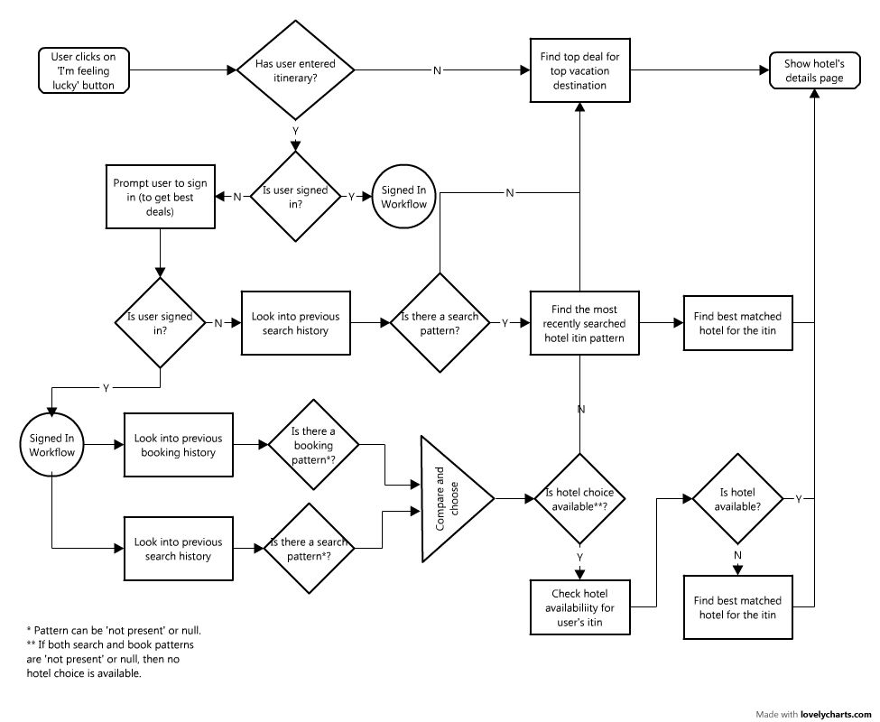

# I Feel Lucky

## Pitch

If you are a Priceline frequent booker, a Priceline fringe booker (who searches a lot but seldom books), or a first time Priceline acquaintance, you are gonna love this! If you know where you wanna go, or you have no clue but just a few free nights to get out of town, you are gonna love this even more! Priceline home page search shows you a 'I'm feeling lucky/wonderful/curious' (phrase changes as you hover) button, that takes you straight to the details page of your best matched hotel. No more hundreds of hotels listings when we can show you exactly what you want! One click, one selection!

## Inspiration

__The Paradox of Choice - Why More is Less by Barry Schwartz__

Autonomy and Freedom of Choice are critical to our well being, and choice is critical to freedom and autonomy. Nonetheless, though modern Americans have more choice than any group of people ever has before, and thus, presumably, more freedom and autonomy, we don't seem to be benefiting from it psychologically.

__Google - 'I am feeling lucky' feature - Why?__

According to Marrisa Meyer ex-Google, it sends out a signal that there are real people on the other side of the search engine. It will become too dry if Google Search sticks just to the search and ads plus promoted search results. The presence of “I’m feeling lucky” button adds a human personality to the search engine.

## Technical opportunities:

- On the back end, the underlying User Behavior Pattern Recognizer will be a thing of beauty. It will take into account your previous booking history and preferences (if available), your recent search pattern and if you are totally unknown to it, then it will look at what others like you like.

- On the front end, the challenge will be to design a new path with attractive features so that customers are lured into trying out this new feature. The subsequent details page needs to be revamped to look more in sync with this look n feel.

## Business Logic

